<!-- ──────────────────────────────────────────────────────────────
     README · github.com/taniashahida-dev
     Banner & divider are hand-coded animated SVGs in /assets
     Palette · #16211D teal · #D6BD98 gold · #7C8B6F sage · #E9E3D3 off-white
─────────────────────────────────────────────────────────────── -->

  

 

  <samp>final-year CS student&nbsp;·&nbsp;building with React, Next.js, Node.js &amp; Express&nbsp;·&nbsp;open to opportunities</samp>

## ✦ About Me

I'm **Tania** — a final-year Computer Science diploma student at **Chittagong Polytechnic Institute** *(expected 2026)* and a full stack web developer who loves turning ideas into real, working products. I build modern web applications with **React, Next.js, Node.js, and Express**, caring as much about clean architecture behind the scenes as the small details users actually feel. What keeps me hooked is understanding *why* systems are designed the way they are — which keeps pulling me deeper into backend architecture and system design. Right now, I'm channeling all of that into preparing for **internship and junior full stack developer roles**.

## ✦ Currently

- **Exploring TypeScript** in greater depth for full stack, server-rendered applications
- **Preparing** for internship and junior full stack developer opportunities
- **Strengthening** my understanding of backend architecture and system design

## ✦ Tech Stack

  

   

  

   

  

   

  

## ✦ Let's Connect

&nbsp;
&nbsp;

## ✦ GitHub Stats

  

 

  <samp>✦&nbsp;&nbsp;thanks for stopping by — let's build something meaningful together&nbsp;&nbsp;✦</samp>

